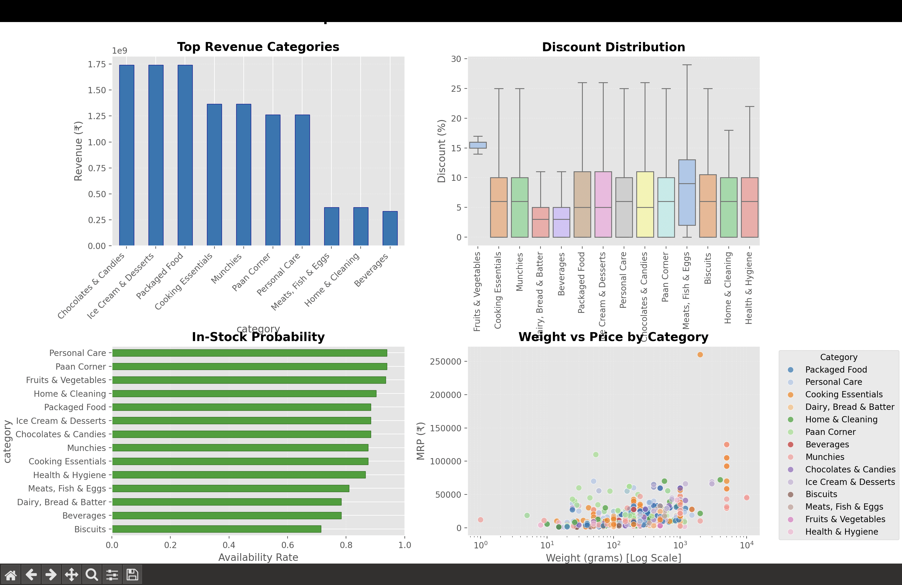

# 🚀 Zepto Analytics  
**Rapid-fire insights for India’s fastest grocery delivery platform.**  

From chocolates to everyday essentials — this tool decodes **demand**, **discounts**, and **delivery performance** at scale.

---

## 🔍 What It Does  
A powerful visual analytics toolkit to explore product sales trends, inventory behavior, and discount strategies in Zepto. Built for clarity, speed, and business value.

📂 Dataset: [Zepto Dataset (Kaggle)](https://www.kaggle.com/datasets/devshahoff/zepto-dataset)

---

### 🧪 Sample Workflow
```python
# Load, clean, and visualize in seconds
df = load_data("zepto.xlsx")
clean_df = standardize_columns(df)
visualize.cleaning(clean_df)
```

✅ Handles multi-sheet Excel files  
✅ Normalizes inconsistent column/category names  
✅ Generates dashboards for revenue, discounts, stockouts, and weight-price curves  

---

## 🧰 Tech Stack

| Layer           | Tools Used                    |
|----------------|-------------------------------|
| Data Wrangling | `pandas`, `numpy`             |
| Visuals        | `matplotlib`, `seaborn`, `plotly` |
| Modeling       | `scikit-learn`, `xgboost` *(planned)* |
| Pipeline       | Python CLI, Jupyter Notebooks |

---

## 🚀 Getting Started

### ✅ Prerequisites
- Python 3.8+
- Zepto dataset in Excel format (`Zepto.xlsx`)

### 🔧 Installation
```bash
git clone https://github.com/yourusername/zepto-analytics.git
cd zepto-analytics
pip install -r requirements.txt
```

### 📈 Run the Analysis
1. Add your dataset:
   ```bash
   mkdir -p data && cp path/to/Zepto.xlsx data/
   ```
2. Launch analysis:
   ```bash
   python main.py
   ```
3. Launch the interactive dashboard:
   ```bash
   streamlit run dashboard.py
   ```

---

## 📊 Key Findings



### 💰 1. Top Revenue Drivers  
- **Chocolates & Candies**, **Ice Cream & Desserts**, and **Packaged Food** exceed ₹1.7B in revenue.  
- Ideal for **bundling** and **promotions** due to consistent demand.

### 🎯 2. Discount Strategy Insights  
- **Fruits & Vegetables** and **Curated For You** offer the **widest discount range** (up to 50%).  
- Essentials like **Cooking Essentials** remain price-stable — important for trust and retention.

### 🛒 3. In-Stock Performance  
- **High stock rates**: Curated For You, Personal Care, Paan Corner (~95%+)  
- **Low stock rates**: Biscuits, Beverages, Dairy/Bread — potential forecasting or supply issues

### ⚖️ 4. Weight vs Price Dynamics  
- Strong **positive correlation** between weight and MRP.  
- **High-weight outliers** (Meats, Packaged Food) suggest premium pricing.

---

## 📝 License  
MIT License — see [LICENSE.md](LICENSE.md)
