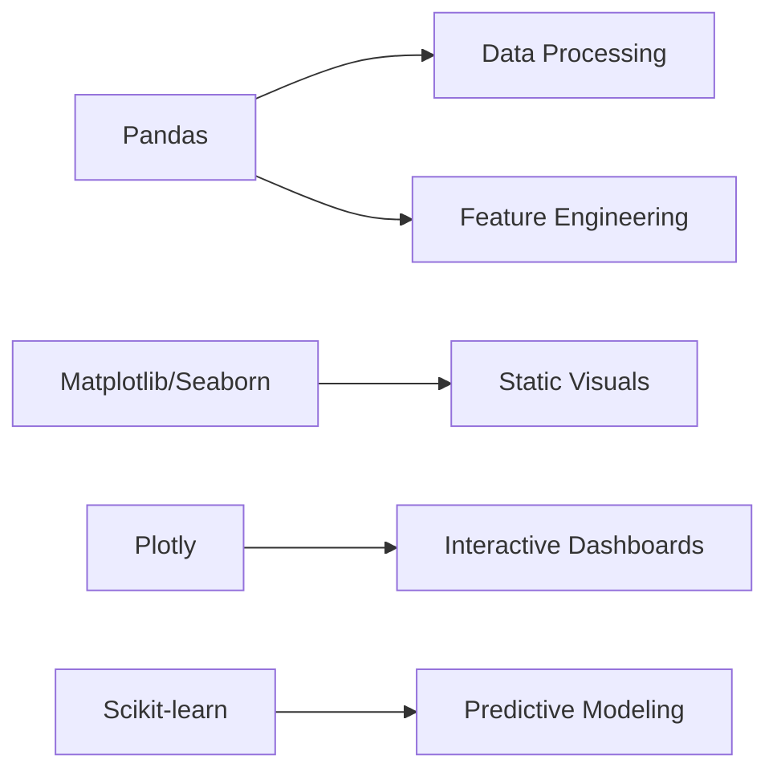

```markdown
# Zepto Analytics 🚀

*Data-Driven Insights for 10-Minute Grocery Delivery*

## 📌 Overview
A comprehensive analytics tool designed to process and visualize Zepto's product demand data across multiple categories, delivering actionable insights on:

- 📈 **Demand Forecasting** - Time-series and seasonal patterns
- 💰 **Pricing Strategy** - MRP vs discount effectiveness 
- 📦 **Inventory Optimization** - Stock-out probability analysis
- 🚚 **Delivery Logistics** - Weight-based efficiency metrics

## ✨ Key Features

| Feature Category       | Capabilities                                                                 |
|------------------------|-----------------------------------------------------------------------------|
| **Data Processing**    | Automatic multi-sheet Excel loading • Smart column standardization          |
| **Visual Analytics**   | Interactive dashboards • Category-wise comparisons • Trend visualizations  |
| **Business Insights**  | Price elasticity analysis • Low-stock alerts • Heavy-item recommendations  |
| **Technical**          | ML-ready feature engineering • Scalable pipeline architecture              |

## 🛠️ Tech Stack

**Core Libraries**


## 🚀 Getting Started

### Prerequisites
- Python 3.8+
- Zepto dataset in Excel format (`Zepto.xlsx`)

### Installation
```bash
git clone https://github.com/yourusername/zepto-analytics.git
cd zepto-analytics
pip install -r requirements.txt
```

### Usage
1. Place your data file:
   ```bash
   mkdir -p data && cp path/to/your/Zepto.xlsx data/
   ```
2. Run analysis:
   ```bash
   python main.py
   ```
3. For interactive dashboard:
   ```bash
   streamlit run dashboard.py
   ```

📊 Findings


1. 💰 Top Revenue Drivers
Chocolates & Candies, Ice Cream & Desserts, and Packaged Food are the highest-grossing categories, each generating revenues above ₹1.7 billion.
These categories present strong candidates for scaling through bundling and promotion due to high customer demand.
2. 🎯 Discount Strategy Insights
Fruits & Vegetables and Curated For You exhibit the widest discount ranges, with medians near 10% and significant outliers reaching 50%.
Other essential categories like Cooking Essentials and Packaged Food show relatively stable discount levels, suggesting price stability in core necessities.
3. 🛒 In-Stock Performance
Curated For You, Personal Care, and Paan Corner show high in-stock rates (~95%+), suggesting robust inventory fulfillment.
In contrast, categories like Biscuits, Beverages, and Dairy, Bread & Batter exhibit stock issues, with in-stock percentages dipping below 70%, highlighting potential supply chain or demand forecasting gaps.
4. ⚖️ Weight vs Price Dynamics
A positive correlation exists between item weight and MRP, with a cluster of high-weight, high-price outliers—particularly in Meats, Fish & Eggs and Packaged Food.
The majority of products lie within the 10g–1000g weight range, showing price consistency across standard household SKUs.

## 📝 License
MIT License - See [LICENSE.md](LICENSE.md)
